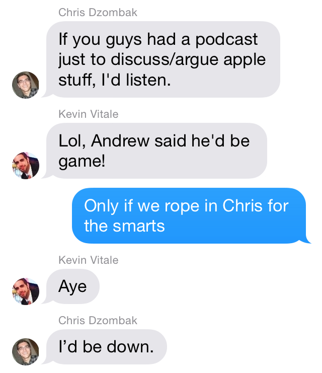

# Code Optional: A podcast about the trials and tribulations of building software

Three engineering comrades – Andrew Sardone, Kevin Vitale, and Chris Dzombak – talk about development, design, and shipping apps. There’s a heavy slant towards Apple tech, balanced with general inquiries around programming and the intricacies/inanities of software.

## Andrew Sardone

Andrew is an Ann Arbor-based software engineer that spends most of his time working on [Nutshell](http://www.nutshell.com/).

## Kevin Vitale

Kevin is a Cocoa developer working in Ann Arbor, MI. He currently develops mobile software at [Duo Security](http://duo.sc). Past accomplishments include [Copy](http://copy.com), [Domino's Pizza](https://www.google.com/url?sa=t&rct=j&q=&esrc=s&source=web&cd=1&cad=rja&uact=8&ved=0CC8QFjAA&url=https%3A%2F%2Fitunes.apple.com%2Fus%2Fapp%2Fdominos-pizza-usa%2Fid436491861%3Fmt%3D8&ei=vS20U86VD5CVyASt_4DgCw&usg=AFQjCNEmJv_KtKJk7OEGFl6F97Cn3JOjAw&sig2=DhMcbVUS4mEqXFoq8mJjPw&bvm=bv.70138588,d.aWw), and [becoming a dad](https://twitter.com/vitalekj/status/344504453073879040).

## Chris Dzombak

Chris is a software engineer in beautiful Ann Arbor. He's working on [Nutshell](http://www.nutshell.com/) now, plus [some personal stuff](https://www.dzombak.com). He previously lived in Brooklyn and worked on [NYT Now](http://nytnow.com).

